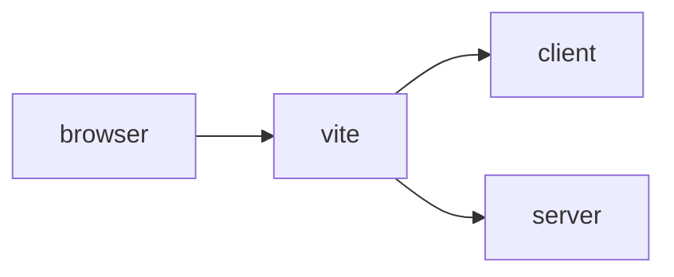
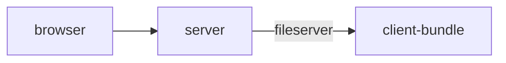

# Vue + Node Server - Application Template
## this package based on
- npm init vue@latest // yes: router, jsx, typescript, unit test, eslint, prettier
- npm install --save-dev nodemon rimraf ts-node zip-build
- npm pack --pack-destination dist // make template.tgz
- tar zxf {template}.tgz // use template

---
## dev: npm run dev

- vite will run as usual from port 5173
- server will start on port 3000
- vite will proxy all calls starting with /srv to server

---
## prod: npm run build

- builds client package
- builds server package
- server will serve static files from client packge when run, keep files in relative to each other

---
## deploy
- Dockerfile should build fine on linux environement
- deploy.ps1 is used to send files to linux server and build docker there.  It also starts the container.
